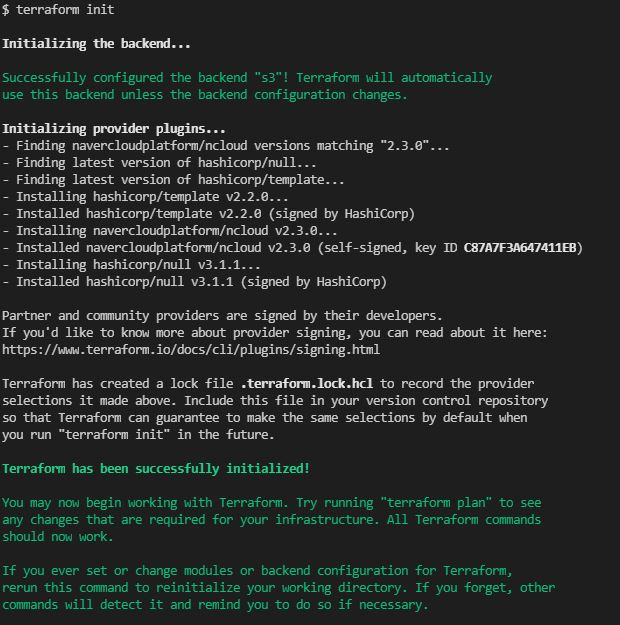
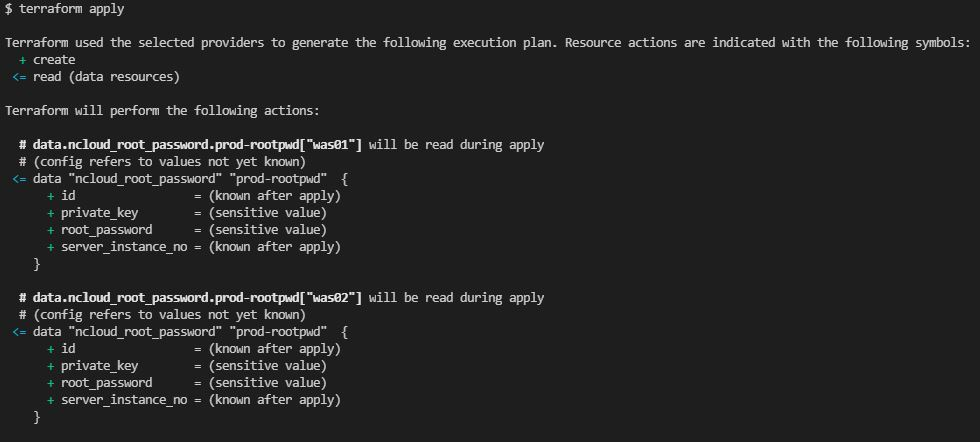

# Ncloud Terraform Template

Terraform template for Ncloud

## Requirements

- Terraform 0.13.x
- Go v1.16.x (to build the provider plugin)
- [Terraform Provider for Naver Cloud Platform](https://github.com/NaverCloudPlatform/terraform-provider-ncloud)

## Go 설치

- https://go.dev/dl/

## Terraform 설치

- [window chocolatey 이용 설치](https://community.chocolatey.org/packages/terraform)
- [직접 설치](https://www.terraform.io/downloads.html)

## terraform provider ncloud 설치

```
mkdir -p $GOPATH/src/github.com/NaverCloudPlatform; cd $GOPATH/src/github.com/NaverCloudPlatform
git clone https://github.com/NaverCloudPlatform/terraform-provider-ncloud.git
cd $GOPATH/src/github.com/NaverCloudPlatform/terraform-provider-ncloud

gofmt -l `find . -name '*.go' | grep -v vendor` | xargs -t -I ARGS sh -c '{ make fmt ARGS; }'

make build

$GOPATH/bin/terraform-provider-ncloud
```

## 사용법

여러사용자가 같이 관리하기 위해, tfstate.tf 파일 보관을
backend s3로 설정

> #main.tf <br>
> backend "s3" { <br>
> ... <br>
> }<br>

### 명령어 수행

#### 1. init

```
terraform init
```



#### 2. apply

```
terraform apply
```


